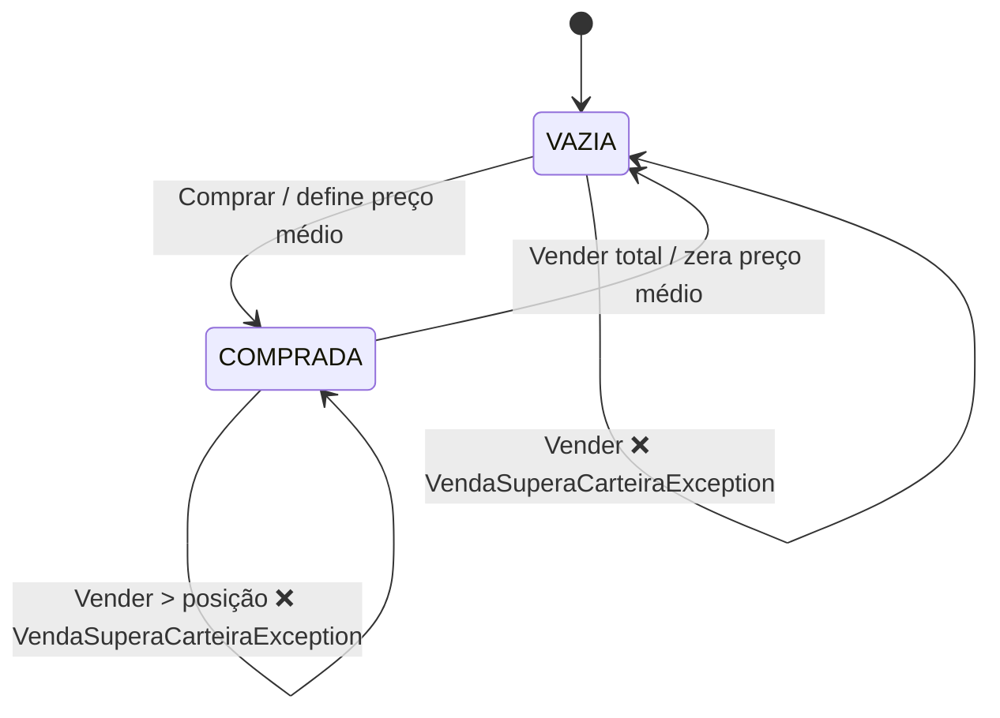

# Máquina de estados da `Carteira`

A `Carteira` ([domain/carteira/Carteira.java](../src/main/java/com/estudos/ganhodecapital/domain/carteira/Carteira.java))
evolui conforme as operações são aplicadas. É modelada como uma máquina de
estados pequena e explícita: `aplicar(EventoOperacao)` primeiro **valida a
transição** (fail-fast) e só então executa a ação.

## Estados

| Estado | Significado |
|--------|-------------|
| `VAZIA` | sem posição — quantidade zero, sem preço médio |
| `COMPRADA` | há ações em carteira, com um preço médio ponderado |

O **prejuízo acumulado** não é um estado: é *extended state* (dado) que as ações
de transição leem e escrevem, junto de preço médio e quantidade.

## Eventos

`EventoOperacao` (selado): `Comprar` | `Vender`, cada um carregando a `Operacao`.

## Diagrama

## Guardas (verificadas antes de qualquer cálculo)

- `Vender` com estado `VAZIA` → `VendaSuperaCarteiraException`
- `Vender` com `quantidade > quantidade em carteira` → `VendaSuperaCarteiraException`

## Ações nas transições de venda

1. `resultado = (preço de venda − preço médio) × quantidade`
2. reduz a posição; se zerou, volta para `VAZIA` e zera o preço médio
3. `resultado < 0` → acumula no prejuízo, imposto zero (mesmo se isenta)
4. venda isenta (`valor total ≤ R$ 20.000`) → imposto zero, **não** mexe no prejuízo
5. senão: `lucro tributável = resultado − prejuízo acumulado`
   - `≤ 0` → sobra vira prejuízo, imposto zero
   - `> 0` → zera o prejuízo, imposto = 20% do lucro tributável

## Por que não usei uma biblioteca de FSM

Com 2 estados e 2 eventos, uma lib (ex.: Spring Statemachine) adicionaria uma
dependência não trivial, um `ExtendedState` baseado em `Map` (perdendo type
safety do preço médio / prejuízo) e gestão de ciclo de vida por simulação —
tudo para substituir ~40 linhas. O ganho pretendido (transições explícitas,
ilegais barradas cedo, tabela testável) já vem da modelagem com `enum` +
`sealed interface`, coberta por
[`CarteiraTest`](../src/test/java/com/estudos/ganhodecapital/domain/carteira/CarteiraTest.java).
