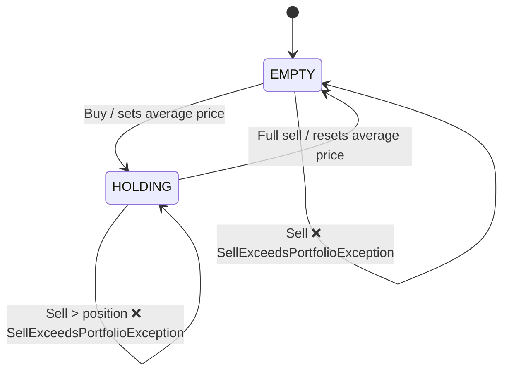

# The `Portfolio` state machine

The `Portfolio` ([domain/portfolio/Portfolio.java](../src/main/java/com/example/capitalgains/domain/portfolio/Portfolio.java))
evolves as trades are applied to it. It is modeled as a small, explicit state
machine: `apply(TradeEvent)` first **validates the transition** (fail-fast) and
only then runs the action.

## States

| State | Meaning |
|-------|---------|
| `EMPTY` | no position — zero quantity, no average price |
| `HOLDING` | shares are held, with a weighted average price |

The **accumulated loss** is not a state: it is *extended state* (data) that the
transition actions read and write, alongside average price and quantity.

## Events

`TradeEvent` (sealed): `Buy` | `Sell`, each carrying the `Trade`.

## Diagram

## Guards (checked before any calculation)

- `Sell` while in state `EMPTY` → `SellExceedsPortfolioException`
- `Sell` with `quantity > quantity held` → `SellExceedsPortfolioException`

## Actions on sell transitions

1. `result = (sell price − average price) × quantity`
2. reduce the position; if it hit zero, go back to `EMPTY` and reset the average price
3. `result < 0` → accumulate into the loss, zero tax (even if exempt)
4. exempt sell (`total value ≤ 20,000`) → zero tax, does **not** touch the loss
5. otherwise: `taxable profit = result − accumulated loss`
   - `≤ 0` → the remainder becomes loss, zero tax
   - `> 0` → reset the loss, tax = 20% of the taxable profit

## Why not an FSM library

With 2 states and 2 events, a library (e.g. Spring Statemachine) would add a
non-trivial dependency, a `Map`-based `ExtendedState` (losing the type safety of
average price / loss) and per-simulation lifecycle management — all to replace
~40 lines. The intended gain (explicit transitions, illegal ones blocked early,
a testable table) already comes from modeling with `enum` + `sealed interface`,
covered by
[`PortfolioTest`](../src/test/java/com/example/capitalgains/domain/portfolio/PortfolioTest.java).
